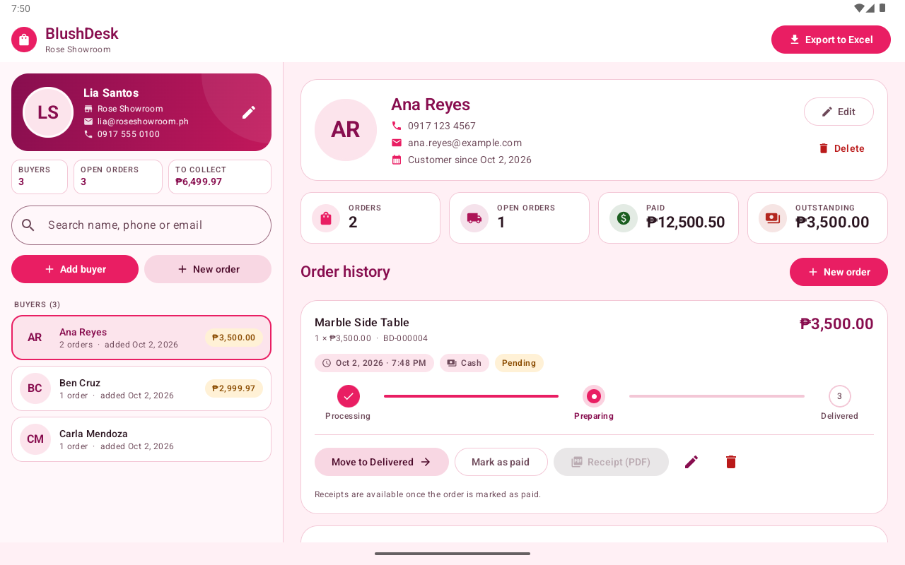
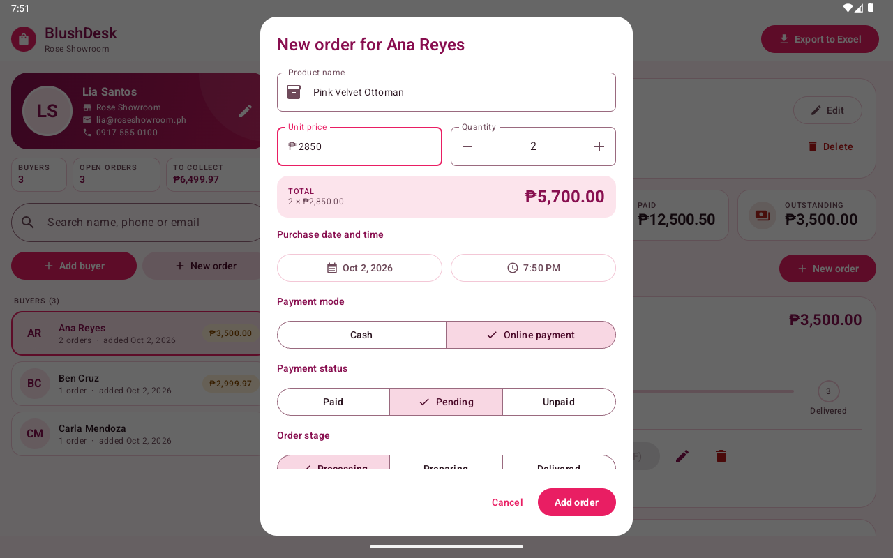
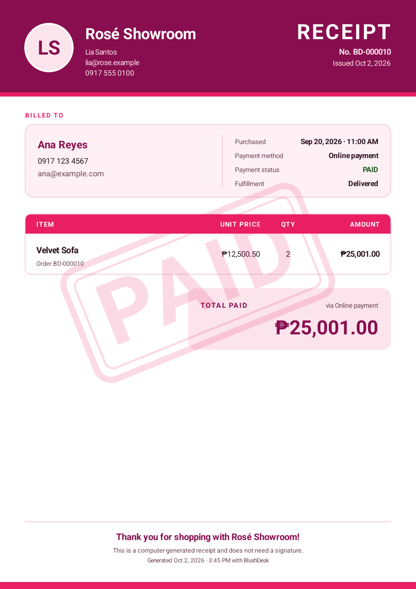
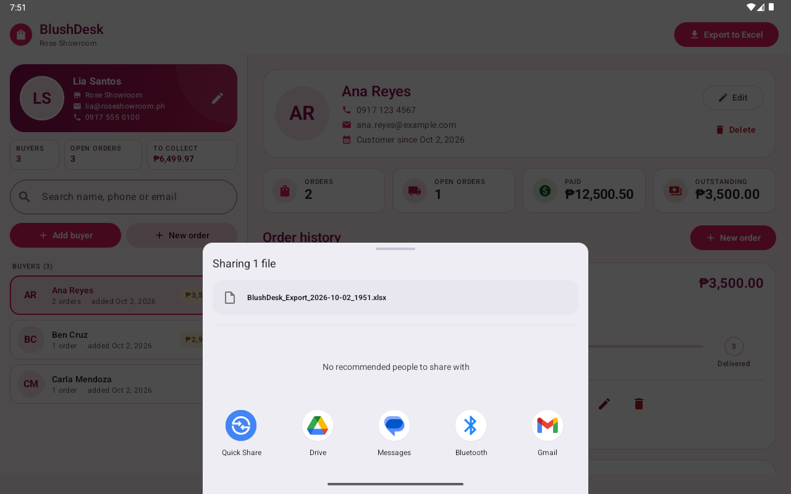

# BlushDesk

An offline Android tablet app for running a showroom counter: keep a list of buyers, record what
they bought, follow each order from processing to delivery, print a PDF receipt for paid orders and
export everything to Excel. Built with Kotlin, Jetpack Compose (Material 3) and Room, with a custom
pink theme.



## Features

**Operator profile.** A card at the top of the left pane shows the tablet user's photo, name,
showroom, email and phone. The first launch asks for these details, because every receipt carries
them. The photo can come from the camera or the gallery.

**Buyers.** Add, edit, search and delete buyers (name, contact number, optional email, photo).
The date added is recorded automatically. The list shows each buyer's order count and unpaid
balance. Deleting a buyer deletes their orders too, after a confirmation.

**Orders.** Product, unit price and quantity, with the total recalculated as you type; purchase
date and time pickers; payment mode (cash or online); payment status (paid, pending or unpaid);
fulfillment stage. Money is stored as whole centavos, so totals never pick up rounding errors.

**Lifecycle tracking.** Each order card shows a Processing → Preparing → Delivered stepper. One tap
on "Move to …" advances it, and tapping any stage sets it directly (which also undoes a mis-tap).
Delivered orders turn green.

**PDF receipts.** Enabled only for paid orders; the button is disabled with an explanation
otherwise, and the generator itself refuses unpaid orders. The A4 receipt has the showroom branding,
buyer details, an itemized line, the total, purchase time, payment method and a semi-transparent
PAID stamp. It is saved to `Download/BlushDesk/` and can be opened (to print) or shared straight
from the app.

**Excel export.** "Export to Excel" in the top bar writes a styled `.xlsx` with three sheets and
opens the Android share sheet (Gmail, Drive, Files, Quick Share, ...):

| Sheet   | Contents |
|---------|----------|
| Summary | Showroom details, totals billed / collected / outstanding, breakdown by stage, payment status and payment mode |
| Orders  | One row per order: number, buyer, contact, product, unit price, quantity, total, purchase time, payment mode, payment status, fulfillment stage |
| Buyers  | One row per buyer with order count, total billed, paid and outstanding |

Header rows are frozen and filterable, money uses a peso number format, and status cells are color coded.

| New order with live total | Receipt | Excel export |
|---|---|---|
|  |  |  |

**Layout.** Designed for a landscape tablet: buyers on the left, the selected buyer's dashboard
on the right. Windows narrower than 600dp (phone, split screen) switch to one pane at a time with
a back arrow. This matters because Android 16+ ignores orientation locks on large screens.

## Tech stack

| Area | Choice |
|---|---|
| Language | Kotlin 2.4, coroutines and Flow |
| UI | Jetpack Compose, Material 3 (Compose BOM 2026.09) |
| Architecture | MVVM with a repository; a small hand-written dependency container |
| Database | Room 2.8 (KSP): entities, DAO, type converters, relations |
| Excel | Apache POI 5.5 (`poi-ooxml`) plus `aalto-xml` for the XML streaming API Android lacks |
| PDF | Android's built-in `PdfDocument` canvas |
| Images | Coil 3, `ExifInterface` |
| Build | AGP 9.4, Gradle 9.8, compileSdk 37, targetSdk 37, minSdk 29 (Android 10) |

## How it is organised

```
app/src/main/java/com/blushdesk/app/
├── data/
│   ├── local/           Room: entities (OperatorProfile, Buyer, Order), enums, Converters,
│   │                    ShowroomDao, ShowroomDatabase, relations (BuyerWithOrders, ...)
│   ├── repository/      ShowroomRepository (interface) + ShowroomRepositoryImpl
│   └── storage/         PhotoStorage, DownloadsSaver, AppFiles (FileProvider folders)
├── domain/              Money, Validation, Formats, BrandPalette: plain Kotlin, unit tested
├── export/              ExcelExporter, PdfReceiptGenerator, DocumentService
├── di/                  AppContainer
└── ui/
    ├── theme/           ShowroomPinkTheme: every color, type, shape and spacing token
    ├── components/      Avatar, StatusChip, OrderStepper, StatCard, AmountText, PhotoPickerField, ...
    ├── dialogs/         EditOperatorProfileDialog, BuyerEditorDialog, OrderEditorDialog, ReceiptReadyDialog
    ├── panes/           MasterPane, DetailPane
    ├── ShowroomTabletScreen.kt, ShowroomViewModel.kt, ShowroomUiState.kt, Sharing.kt
```

Data flows one way. Room emits `Flow`s, `ShowroomViewModel` combines them into a single
`ShowroomUiState`, and the screen renders that state and calls view model functions. One-off
results (a message, "receipt ready", "share this workbook") arrive as events on a channel. The
view model depends only on interfaces (`ShowroomRepository`, `DocumentService`, `PhotoStore`),
which is what lets its unit tests run on the JVM with fakes.

### Database

```
operator_profile (one row)      buyers 1 ──── * orders
  fullName, storeName,            id, fullName,     id, buyerId (FK, ON DELETE CASCADE),
  email, phone, photoPath         contact, email,   productName, unitPriceMinor, quantity,
                                  dateAdded,        purchasedAt, paymentMode, paymentStatus,
                                  photoPath         orderStatus
```

- Amounts are `Long` centavos (`unitPriceMinor`). The total is derived (`unitPriceMinor * quantity`) and never stored.
- Enums are stored by name, not position, so reordering them cannot relabel old rows.
- The schema is exported to `app/schemas/` so future migrations can be written and tested.
  There is deliberately no destructive-migration fallback: this is the shop's only copy of its records.

## Permissions, files and privacy

The app requests **no runtime permissions** and declares none of its own. The only entry in the
built APK is `DYNAMIC_RECEIVER_NOT_EXPORTED_PERMISSION`, which androidx.core adds. It is
signature-level and private to the app, and users never see it.

- **Gallery photos** come through the system Photo Picker, so the user hands over one image.
- **Camera photos** are taken by the device's camera app, which writes to a FileProvider URI.
  The app never needs the `CAMERA` permission.
- **Receipts** are copied into Downloads through MediaStore, which needs no storage permission on Android 10+.
- **Sharing** uses `content://` URIs from a FileProvider, and `res/xml/file_paths.xml` exposes
  only the `receipts/`, `exports/` and `camera/` cache folders. A test checks that anything else,
  including the database, is refused.
- **Photos** are downsized (longest edge 1024 px) and copied into private storage. Replaced or
  abandoned photos are deleted.
- **Backups** are off, both cloud and device-to-device, because the database holds customers'
  personal details.
- **Network:** the app has none. `INTERNET` is not declared.

## Building and running

Requirements: Android Studio (its bundled JDK works; tested with JBR 25) and the Android SDK with
platform 37 installed.

```bash
./gradlew :app:assembleDebug        # build the APK
./gradlew :app:installDebug         # install on a running emulator or device
```

For the intended experience use a tablet emulator in landscape (for example a 10.1" WXGA profile).

## Tests

```bash
./gradlew :app:testDebugUnitTest            # 47 JVM tests, no device needed
./gradlew :app:connectedDebugAndroidTest    # 37 tests on a running emulator or device
```

- **Unit tests:** money parsing and formatting, validation, date formats, converters, LIKE-pattern
  escaping, the Excel workbook's content (POI on the JVM), and the view model against fake
  repository and document services.
- **Instrumented tests:** the real SQL (cascade delete, foreign keys, aggregates, search with
  `%` and `_`), Apache POI running on Android's runtime, PDF generation rendered back to pixels
  (header color, PAID stamp, operator photo, refusal of unpaid orders), photo import (downsizing,
  EXIF rotation, non-images), Downloads saving and replacing, and FileProvider access rules.

The PDF test also writes PNG renders of each receipt to the app's `files/test-artifacts/`, so a
person can look at the output.

## Configuration

- **Currency:** `Money.SYMBOL` in `domain/Money.kt` (peso by default). The PDF and Excel formats follow it.
- **Brand colors:** `domain/BrandPalette.kt` feeds the Compose theme, the PDF and the Excel styles,
  so a rebrand is a one-file change.

## Known limitations

- **Release builds** run without R8 shrinking, so the unsigned release APK is about 70 MB.
  POI loads schema classes by name; `app/proguard-rules.pro` has a starting set of keep rules,
  but shrinking has not been verified, so it is off. No release signing is configured.
- **One product per order**, so a receipt has a single line item.
- **Light theme only**, on purpose: the pink palette is the brand.
- **Test coverage:** tested on an Android 15 (API 35) tablet emulator, not yet on an Android 16+
  device or real hardware.
